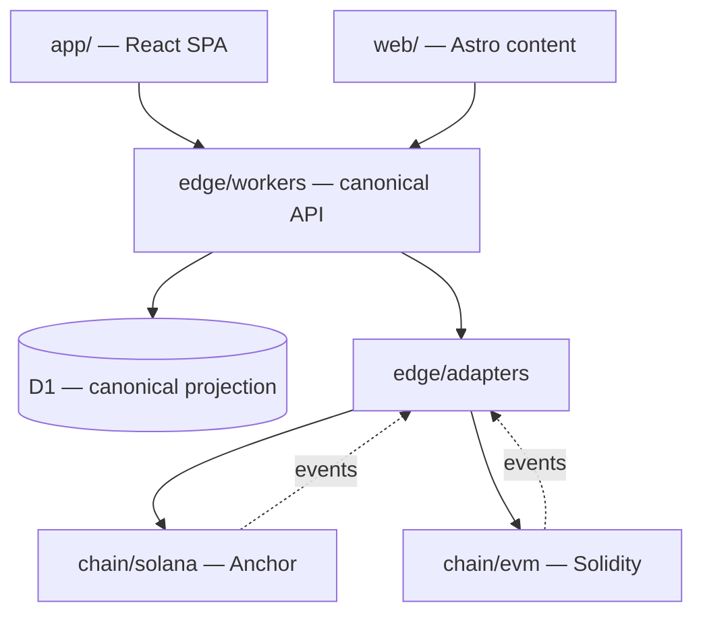
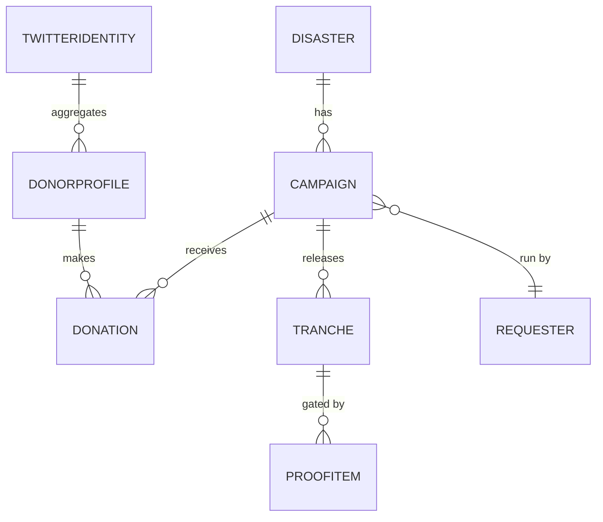

# Architecture Spine — Aid Protocol

## Design Paradigm

**Per-chain on-chain core + unified off-chain edge — ports & adapters over a canonical model.**

The same logical contract (escrow + proof-gated release + donor record) is **replicated natively per chain** (Solana program, EVM contracts). Everything above the chain is **chain-agnostic**: indexers normalize each chain's events into **one canonical off-chain model**, and all product logic, APIs, and UI speak only that model. Chain-specific code is quarantined inside **adapters**; the rest of the system never imports a chain SDK.

| Layer | Responsibility | Namespace |
| --- | --- | --- |
| **On-chain core** | Custody, escrow, milestone release, on-chain donor/proof records | `chain/solana/` (Anchor), `chain/evm/` (Solidity) |
| **Adapters (ports)** | Normalize chain events → canonical; submit chain txs | `edge/adapters/{solana,evm}/` |
| **Edge services** | API, Twitter oracle, indexer ingest, image generator, AI pipeline | `edge/workers/` |
| **Canonical store** | One normalized schema for campaigns, donations, profiles, proofs | Cloudflare D1 |
| **Client** | Donor/requester SPA; wallet connect (both chains) | `app/` (Vite + React on Cloudflare) |
| **Content** | Blog/news landing (SEO) | `web/` (Astro on Cloudflare) |

> **As-built note (2026-06-30):** the table above is the **target** decomposition. Today the off-chain edge runs as two Cloudflare Workers (AD-14): the **app** Worker (`app/` SPA + `app/worker/` canonical API, admin, news cron) and the **apex** Worker (`app/coming-soon/` growth and comms). The `edge/{adapters,workers}` split and the Astro `web/` surface remain target direction. Chain calls currently live in `app/src/wallet` and `app/src/contracts.ts`.

## Invariants & Rules

### AD-1 — Chain isolation behind adapters `[ADOPTED ADR-005]`
- **Binds:** all
- **Prevents:** SVM/EVM specifics leaking upward; two teams building divergent fund/identity semantics.
- **Rule:** No chain SDK (`@solana/*`, `viem`, `wagmi`) may be imported outside `chain/**` or `edge/adapters/**`. Everything above consumes only the canonical model.

### AD-2 — On-chain is the financial source of truth; off-chain is a projection `[ADOPTED]`
- **Binds:** all read/write of money & donor totals
- **Prevents:** the indexer/D1 becoming a second, divergent ledger; trust claims that can't be proven on-chain.
- **Rule:** Funds and contribution records live on-chain. D1 is a **rebuildable projection** of chain events — never the authority. Any displayed total must be reconstructable from chain data.

### AD-3 — Escrow with proof-gated milestone release `[ADOPTED ADR-001]`
- **Binds:** fund flow
- **Prevents:** direct-payout scam exposure.
- **Rule:** Funds are escrowed in the contract. Tranche *N+1* unlocks **only** after tranche *N*'s proof-of-spend passes the AI pipeline (AD-7). First-tranche size by identity tier (AD-5): **L2 = 40%, L1 = 15%, new/thin = tiny fixed cap (~$250)** until first proof clears. Remaining balance unlocks in proof-gated tranches. Percentages are tunable policy.

### AD-4 — Pause/clawback authority `[ADOPTED ADR-001]`
- **Binds:** every campaign
- **Prevents:** runaway fraud after a bad actor passes verification.
- **Rule:** A core-team multisig — **Squads on Solana, Safe on EVM** (no DAO) — can **freeze** a campaign and **redirect undisbursed escrow** to another verified campaign for the same disaster (never auto-refunded). This authority is encoded in every campaign's contract instance.

### AD-5 — Public-identity verification tiers; no KYC in v1 `[ADOPTED ADR-004]`
- **Binds:** requester onboarding, AD-3 tranche sizing
- **Prevents:** regulatory data-controller burden and exclusion of disaster-zone individuals.
- **Rule:** Requesters are tiered by **public** identity, never gov-ID KYC in v1. **L1 floor** = aged Twitter/X account (age + real-follower threshold) + public post linking to the campaign; **L2** = verified public entity/org. Requester identity is always public. Sign-off before go-live is by **core team + a few trusted reviewers** (no DAO; requires a reviewer-permission model). Identity tier sets release generosity (AD-3).

### AD-6 — Donor identity: on-chain record is truth, off-chain aggregates across wallets & chains `[ADOPTED ADR-002]`
- **Binds:** profiles, leaderboards, badges
- **Prevents:** NFT-as-database; a separate identity per chain.
- **Rule:** Per-wallet on-chain record (PDA on Solana, mapping on EVM) is canonical. The off-chain layer aggregates a donor's wallets **across both chains**, optionally under one Twitter handle. Badges are **derived** from cumulative USD-normalized giving via **fixed named tiers** (Supporter $10 · Bronze $100 · Silver $500 · Gold $2.5k · Platinum $10k; tunable). Public profiles served from the D1 projection at **`/u/<twitter-handle>`** (linked) and **`/w/<wallet>`** (unlinked). No NFT is required for data or sharing; any future badge NFT (P4) must be **soulbound**.

### AD-7 — Proof media must pass the AI pipeline before it can gate release or publish `[ADOPTED ADR-001/002/003]`
- **Binds:** proof-of-spend
- **Prevents:** fraudulent/AI-faked or graphic media reaching donors or unlocking funds.
- **Rule:** Proof media enters via Queues → R2 (images) / Cloudflare Stream (recorded video), runs **Cloudflare Workers AI** moderation + first-pass authenticity, with low-confidence escalated to a **human reviewer**. Only a **pass** emits the on-chain proof signal that AD-3 consumes. No pass → no publish, no unlock.
- **Live streams** (Stream Live / Cloudflare Realtime) cannot be pre-filtered: they run **delayed + human moderation** while live; the **archived recording** then runs the full AI pass, and only the passed recording can gate release.

### AD-8 — Stablecoin-preferred, per-chain curated token registry `[ADOPTED brief Q-D]`
- **Binds:** accepted assets, badge/leaderboard math
- **Prevents:** victims bearing volatility; cross-chain totals that aren't comparable.
- **Rule:** Each chain has a **core-team-curated allowlist**; **USDC is the default settlement asset** on both chains. Every donation is normalized to **USD-equivalent at donation time**, stamped **off-chain by the indexer** from a price feed (Pyth/CoinGecko) at ingest — no on-chain oracle (consistent with AD-2). Used for badges and leaderboards.

### AD-9 — Cloudflare-only web tier; no Next.js `[ADOPTED ADR-006]`
- **Binds:** all client + edge code
- **Prevents:** hosting/framework drift off the constraint.
- **Rule:** Client is a **Vite + React SPA** deployed to Cloudflare via the official Cloudflare Vite plugin (Pages/Workers runtime). All server logic runs in **Cloudflare Workers**; data/media/AI use **D1 / KV / R2 / Queues / Workers AI**. **Next.js is forbidden.**

### AD-10 — Smart contracts build & test only in Docker `[ADOPTED]`
- **Binds:** `chain/**`, CI
- **Prevents:** "works-on-my-machine" drift across the Anchor (Rust) and Foundry (Solidity) toolchains; non-reproducible contract builds/audits.
- **Rule:** Both chains' contracts are built **and** tested inside **pinned Docker images** (one per chain toolchain). Host installs of `solana`/`anchor`/`foundry` are conveniences, not authoritative; **CI uses the same images**. A green build means green *in the container*.

### AD-11: Off-chain person-identity via X OAuth, server-side only; identity is never a financial authority `[ADOPTED]`
- **Binds:** all non-wallet identity (testers, requester public-identity link, donor Twitter aggregation)
- **Prevents:** X tokens or secrets reaching the browser; conflating "signed in with X" with money authority; a second auth path that can move funds.
- **Rule:** X (Twitter) OAuth 2.0 + PKCE runs entirely inside a Worker; the client secret and access tokens never reach the client; sessions are HttpOnly cookies backed by KV with short TTL. X is an attestation and contact signal only. Wallet-signature auth (not X) authorizes money writes, and AD-2 keeps on-chain authoritative. X does not return email; any email is user-supplied and validated separately (AD-13).

### AD-12: Telegram is the community comms and notification channel, linked by one-time deep-link token, never a financial authority `[ADOPTED]`
- **Binds:** tester, ambassador, and requester comms; 2FA; proof-of-spend reminders
- **Prevents:** an unverified chat acting for someone; the bot becoming an auth or money path; webhook spoofing.
- **Rule:** The bot webhook is verified by a secret-token header. A chat links to a verified identity only via a single-use, short-TTL deep-link token (`/start <token>`) minted inside that identity's authenticated session. 2FA codes are hashed, single-use, and TTL-bounded. Telegram is contact, notification, and step-up only; it never authorizes fund movement (AD-2 and AD-4 unchanged).

### AD-13: Growth and trust surface sits off the money-critical path; eligibility uses public-identity signals; rewards never bypass escrow or proof `[ADOPTED]`
- **Binds:** tester whitelist, ambassador program, eligibility scoring
- **Prevents:** growth incentives becoming a backdoor around escrow or verification; sybil or bot testers; treating reward payouts as campaign funds.
- **Rule:** Eligibility gates on public-identity signals (account age, real-follower floor, follow of the project account, non-disposable email) consistent with AD-5 tiers, validated via a public-data adapter (RapidAPI). Tester and ambassador rewards are capped, manual, paid out-of-band, and never relax AD-3, AD-4, or AD-7. Eligibility data lives in D1 as a rebuildable projection, never an authority over money.

### AD-14: Two-Worker edge topology over shared D1 and KV; the projection rule holds across both `[ADOPTED]`
- **Binds:** edge deployment, data ownership
- **Prevents:** divergent data authorities between the two Workers; either Worker becoming a money authority; routing or role drift.
- **Rule:** The edge runs as two Cloudflare Workers sharing one D1 and KV: the **app** Worker (product: SPA, canonical API, admin, news cron) and the **apex** Worker (growth and comms: coming-soon, tester whitelist, Telegram bot, 2FA). Both treat D1 as the rebuildable projection (AD-2); neither is the financial source of truth. Cross-Worker shared state goes through D1 and KV, never private Worker-to-Worker coupling. `run_worker_first` guards `/api/*` so the SPA asset-fallback never shadows API routes.



## Consistency Conventions

| Concern | Convention |
| --- | --- |
| Naming | Canonical entities `PascalCase` (Campaign, Donation, DonorProfile, ProofItem, Disaster); Workers routes `/v1/<resource>` kebab; chain programs/contracts named `aid_<domain>`. |
| IDs | Canonical IDs are `<chain>:<nativeId>` (e.g. `sol:<pubkey>`, `evm:<chainId>:<addr>`); never reuse a raw chain id as a global id. |
| Money | Store native amount + token + `usdAtDonation` (8-dp integer minor units); never float. USDC is the settlement default. |
| Dates / events | UTC ISO-8601; chain events carry block time + slot/blockNumber for ordering & replay. |
| Errors / envelopes | All Workers return `{ ok, data?, error: { code, message } }`; codes are stable enums. |
| State & mutation | Money state mutates **only** on-chain; D1 mutates **only** via the indexer ingest path (idempotent on `{chain,txSig,logIndex}`). |
| Auth | Wallet-signature auth for write intents; Twitter-link via one-time-code oracle; core-team actions behind multisig. |
| Config / secrets | Per-environment via Workers bindings/secrets; token registries in KV; no secrets in client bundle. |
| Contract build/test | Run via Docker only (AD-10): `docker compose run anchor anchor test`, `docker compose run foundry forge test`. Images pinned; CI calls the identical images. |

## Stack

| Name | Version |
| --- | --- |
| Rust + Anchor (Solana program) | Anchor 1.0.2 |
| Solidity + Foundry (EVM contracts) | Solidity ^0.8.26 · Foundry (current stable) |
| TypeScript | 5.x |
| Vite + React (client SPA) | Vite 8 · React 19 |
| Cloudflare Vite plugin | 1.0 |
| Cloudflare Workers / D1 / KV / R2 / Queues / Workers AI | platform (current) |
| Astro (content/landing) | current stable |
| Solana wallet adapter | `@solana/wallet-adapter` (current) |
| EVM client libs | `wagmi` + `viem` (current) |
| EVM networks | Ethereum mainnet + Base (L2) |
| Multisig (clawback) | Squads (Solana) · Safe (EVM) |
| Indexing webhooks | Helius (Solana) · Alchemy (EVM) |
| Price feed (USD stamp) | Pyth / CoinGecko |
| Video / live | Cloudflare Stream · Stream Live · Cloudflare Realtime |

> Versions are seed — verify-at-pin; the code owns them once it exists.

## Structural Seed

```text
aid-protocol/
  chain/
    solana/        # Anchor program: escrow, milestone release, DonorProfile PDA
    evm/           # Solidity: escrow + donor record (mapping), events
    docker/        # pinned toolchain images: solana-anchor.Dockerfile, foundry.Dockerfile (AD-10)
  edge/
    adapters/
      solana/      # event normalize + tx submit (only place @solana/* is imported)
      evm/         # event normalize + tx submit (only place viem is imported)
    workers/
      api/         # canonical read/write API (/v1/*)
      indexer/     # queue-driven ingest -> D1 (idempotent)
      oracle/      # Twitter ownership attestation
      imagegen/    # badge card renderer (reads canonical model)
      ai/          # proof authenticity + moderation pipeline (ADR-003)
  app/             # Vite + React SPA (donor + requester), both-chain wallet connect
  web/             # Astro blog/news landing (SEO)
  packages/
    canonical/     # shared canonical model types + id helpers (no chain SDKs)
  docs/            # brief, ADRs, this spine
```



```mermaid
sequenceDiagram
  participant D as Donor (SPA)
  participant C as Chain escrow
  participant Q as Queue/R2
  participant AI as AI pipeline
  participant X as Chain (release)
  D->>C: donate (SOL/SPL or ETH/ERC-20)
  Note over C: funds escrowed, tranche 1 unlocked by tier
  C-->>Q: requester posts proof of tranche N spend
  Q->>AI: authenticity + moderation
  AI-->>X: PASS -> on-chain proof signal
  X->>X: unlock tranche N+1 (AD-3)
  Note over X: FAIL -> no publish, no unlock; freeze possible (AD-4)
```

## Capability → Architecture Map

| Capability / Area | Lives in | Governed by |
| --- | --- | --- |
| Collect funds (multi-chain) | `chain/{solana,evm}` + `edge/adapters` | AD-1, AD-2, AD-8 |
| Escrow & milestone release | `chain/**` | AD-3, AD-4 |
| Requester verification | `edge/workers/api` + human sign-off | AD-5 |
| Donor profiles / leaderboard / badges | on-chain record + `edge/indexer` + D1 | AD-2, AD-6, AD-8 |
| Twitter link & share image | `edge/workers/oracle` + `imagegen` | AD-6, AD-9 |
| Proof-of-spend + AI filtering | `edge/workers/ai` + Queues + R2 | AD-7 |
| Donor/requester app | `app/` | AD-9 |
| Blog/news landing | `web/` | AD-9 |
| Person identity & sessions (X OAuth) | `app/worker` + `app/coming-soon` + KV | AD-11 |
| Tester whitelist & ambassador growth | `app/coming-soon` + D1 | AD-13, AD-5 |
| Community comms & 2FA (Telegram bot) | `app/coming-soon` + D1 | AD-12 |
| News ingestion (ReliefWeb + Google News) | `app/worker` cron + D1 | AD-2 |

## Deferred

All v1 open questions/assumptions were resolved with the user (2026-06-27) and folded into the ADs above. What remains genuinely deferred:

- **AI model selection & thresholds** — *direction set* (Workers AI + human fallback, AD-7); exact model picks and confidence thresholds tuned during P1 build, no architecture change.
- **Reviewer-permission model details** — how trusted reviewers (AD-5) are granted/revoked; a permissioning sub-design for P1.
- **Final L2 choice confirmation** — Base is the default L2 (mainnet also targeted); swap is a config-level change.
- **Reputation graduation curve** (P3) — how proven good actors earn faster/larger unlocks; AD-3/AD-6 fix the invariants it builds on.
- **Soulbound badge NFT mint** (P4) — gated on a proper artist; AD-6 already fixes it must be soulbound and PDA-derived.
- **Token-registry curation workflow** — the ops process for adding SPL/ERC-20 tokens to the per-chain allowlist (AD-8).
- **Edge decomposition** — splitting the current app Worker into the target `edge/{adapters,workers}` services (api, indexer, oracle, imagegen, ai) and standing up the Astro `web/` surface; AD-1, AD-2, and AD-14 fix the invariants that split must preserve.
- **Chain indexer** — the Helius/Alchemy webhook to Queues to D1 projection (AD-2) is target; current campaign/donation data is served directly. No architecture change when built.
- **Account-age eligibility source** — the RapidAPI `/user` endpoint did not reliably return `created_at`; the data source for the tester account-age gate (AD-13) is an open item to confirm or replace at build.

### Resolved (now in the ADs)
| Question | Resolution |
| --- | --- |
| P0 chain sequencing | **Both chains in parallel** (not Solana-first) |
| EVM target | **Ethereum mainnet + Base (L2)** |
| Clawback tooling | **Squads (SOL) + Safe (EVM)** → AD-4 |
| Frozen-fund policy | **Redirect to same-disaster campaign** → AD-4 |
| Tranche sizing | **L2 40% / L1 15% / new ~$250** → AD-3 |
| L1 individual floor | **Aged Twitter + public campaign post** → AD-5 |
| Campaign approver | **Core team + trusted reviewers** → AD-5 |
| AI pipeline | **Workers AI + human fallback** → AD-7 |
| USD normalization | **Off-chain at index time (Pyth/CoinGecko)** → AD-8 |
| Indexing | **Helius/Alchemy webhooks → Queues → Workers → D1** |
| Media / live | **Stream + Stream Live/Realtime; archived recording gates release** → AD-7 |
| Landing page | **Astro on Cloudflare** → AD-9 |
| Badge tiers | **Fixed named USD thresholds** → AD-6 |
| Public profiles | **`/u/<twitter>` + `/w/<wallet>`** → AD-6 |
